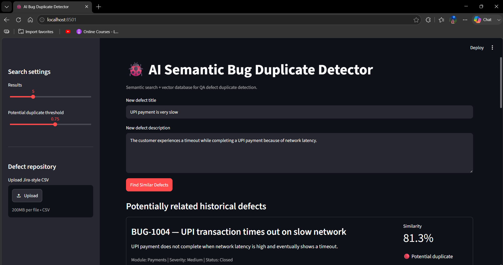
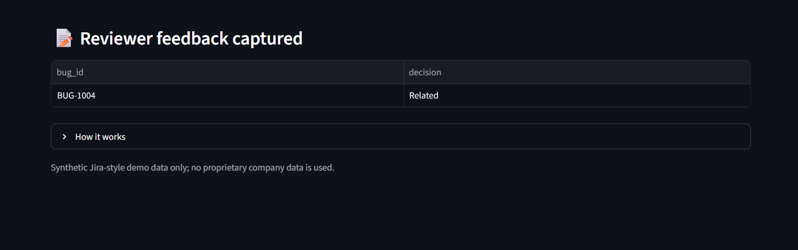
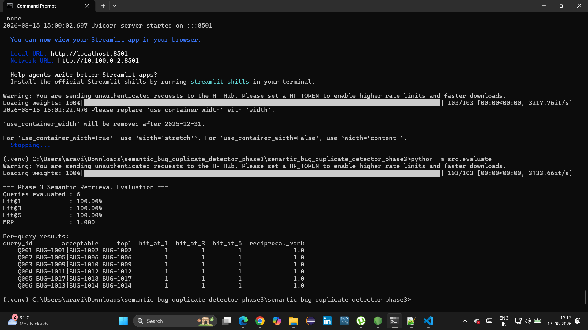

final readme: 
# AI Semantic Bug Duplicate Detector


An AI-assisted QA tool that identifies potentially duplicate Jira-style defects using semantic embeddings and vector similarity search.


## Problem Statement


In a QA environment, a newly reported defect may already exist in the defect repository with different wording.


Traditional keyword-based searches may fail to identify these semantically similar defects.


This project provides a semantic search-based assistant that helps QA engineers find potentially duplicate historical defects before logging a new defect.


## Solution


The application:


1. Accepts a new defect title and description.
2. Converts the defect text into an embedding using Sentence Transformers.
3. Searches historical defect embeddings stored in ChromaDB.
4. Retrieves the Top-K most similar defects.
5. Calculates a similarity score for each result.
6. Applies a configurable similarity threshold.
7. Allows a QA reviewer to classify each result as:
   - Confirm duplicate
   - Not duplicate
   - Related
8. Captures reviewer decisions during the current Streamlit session.


## Key Features


- Semantic defect similarity search
- Sentence Transformer embeddings
- ChromaDB vector database
- Configurable Top-K results
- Configurable duplicate similarity threshold
- Jira-style CSV defect repository
- Reviewer feedback capture
- Evaluation using Hit@1, Hit@3, Hit@5 and MRR
- Streamlit-based user interface
- Synthetic dataset with no proprietary company information


## Architecture


```text
                         New Defect
                    Title + Description
                             |
                             v
                    +----------------+
                    |  Streamlit UI  |
                    +-------+--------+
                            |
                            v
                 +----------------------+
                 | Sentence Transformers|
                 |   Text -> Embedding  |
                 +----------+-----------+
                            |
                            v
                     +-------------+
                     |  ChromaDB   |
                     | Vector Store|
                     +------+------+ 
                            |
                            v
                  Semantic Similarity
                         Search
                            |
                            v
                       Top-K Results
                            |
                            v
                 Similarity Threshold
                            |
                            v
                     QA Reviewer
                    /      |       \
                   /       |        \
          Duplicate   Related   Not Duplicate
                   \       |        /
                    \      |       /
                     Reviewer Feedback
```

## Technology Stack

- Python
- Streamlit
- Sentence Transformers
- ChromaDB
- Pandas
- Git / GitHub

## Project Structure

```text
ai-semantic-bug-duplicate-detector/
│
├── app.py
├── README.md
├── requirements.txt
│
├── data/
│   ├── synthetic_jira_defects.csv
│   └── evaluation_pairs.csv
│
├── src/
│   ├── __init__.py
│   ├── evaluate.py
│   ├── index_defects.py
│   └── search.py
│
└── screenshots/
    ├── UI.png
    ├── evaluation-results.png
    ├── semantic-search-review.png
```

## How It Works

### 1. Defect Input

The QA engineer enters a new defect title and description.

### 2. Text Embedding

The defect title and description are converted into a numerical vector using a Sentence Transformer model.

### 3. Vector Search

The embedding is compared against historical defect embeddings stored in ChromaDB.

### 4. Similarity Ranking

The application returns the most semantically similar historical defects along with similarity scores.

### 5. Duplicate Classification

The similarity score is used as an initial signal.

The QA reviewer makes the final decision:

- Confirm duplicate
- Not duplicate
- Related

The AI provides a recommendation; the reviewer remains responsible for the final classification.

## Screenshots

### Application UI



### Semantic Search Results and Reviewer Decision



### Evaluation Results



## Evaluation

The project includes a semantic retrieval evaluation set where multiple historical defects can be valid matches.

Run:

```bat
python -m src.evaluate
```

Example evaluation output:

```text
=== Phase 3 Semantic Retrieval Evaluation ===

Queries evaluated : 6
Hit@1             : 100.00%
Hit@3             : 100.00%
Hit@5             : 100.00%
MRR               : 1.000
```

## Evaluation Metrics

### Hit@1

Measures whether an acceptable match appears as the first search result.

### Hit@3

Measures whether an acceptable match appears within the top three results.

### Hit@5

Measures whether an acceptable match appears within the top five results.

### MRR (Mean Reciprocal Rank)

Measures how highly the first acceptable match is ranked.

## Dataset

The project uses synthetic Jira-style defect data.

The dataset contains no proprietary company information.

Files:

```text
data/synthetic_jira_defects.csv
data/evaluation_pairs.csv
```

## Installation

Clone the repository and navigate to the project directory.

Create a virtual environment:

```bat
python -m venv .venv
```

Activate the environment:

```bat
.venv\Scripts\activate
```

Install dependencies:

```bat
pip install -r requirements.txt
```

## Index Historical Defects

Before running the application, index the historical defect dataset:

```bat
python src\index_defects.py
```

This converts the historical defects into embeddings and stores them in ChromaDB for similarity search.

## Run the Application

Start the Streamlit application:

```bat
streamlit run app.py --server.fileWatcherType none
```

The application will open in the browser.

Enter a new defect title and description and click:

```text
Find Similar Defects
```

The application will display the most similar historical defects and their similarity scores.

## Reviewer Feedback

For each retrieved defect, the reviewer can select:

- No decision
- Confirm duplicate
- Not duplicate
- Related

Once a decision is selected, the application displays:

```text
Feedback recorded
```

Reviewer decisions are displayed in the **Reviewer feedback captured** section during the current application session.

## Example Use Case

A QA engineer receives a new defect:

```text
UPI payment is very slow
```

The description indicates that the payment times out because of network latency.

The system searches the historical defect repository and returns:

```text
BUG-1004 — UPI transaction times out on slow network
Similarity: 81.3%
```

The system flags it as a potential duplicate.

The QA reviewer can then select:

```text
Related
```

The decision is captured by the application for the current session.

## Configuration

The Streamlit sidebar provides two configurable search settings.

### Number of Results

Controls how many historical defects are returned.

```text
Top-K: 3 - 10
```

### Potential Duplicate Threshold

Controls the similarity score above which a result is labelled:

```text
Potential duplicate
```

The default threshold is:

```text
0.75
```

## Limitations

- Similarity does not guarantee that two defects are actual duplicates.
- The final classification requires QA reviewer judgment.
- The current reviewer feedback is session-based and is not stored in a permanent database.
- The evaluation dataset is synthetic.
- Model performance may vary depending on the quality and diversity of historical defect data.
- The application is intended as a decision-support tool rather than a fully autonomous defect classifier.

## Future Improvements

- Persistent reviewer feedback storage
- Learning from reviewer decisions
- Integration with Jira APIs
- Automatic defect creation
- Authentication and role-based access
- Advanced evaluation datasets
- Model comparison and tuning
- Feedback-driven similarity threshold optimization
- Production deployment
- Monitoring and logging

## Project Status

**Phase 3 completed**

Current capabilities include:

- Semantic defect retrieval
- Vector database search
- Configurable similarity threshold
- Top-K retrieval
- Reviewer classification
- Reviewer feedback capture
- Semantic retrieval evaluation
- GitHub project documentation

## Author

**Aravindhan E**

AI-assisted QA / Software Testing project focused on semantic defect duplicate detection.